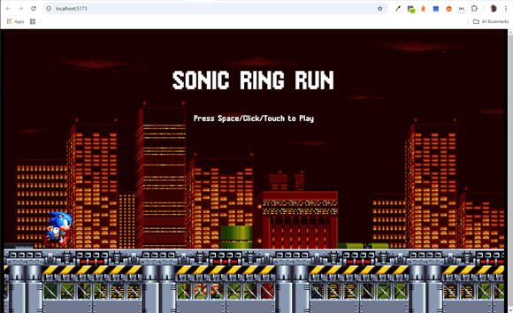
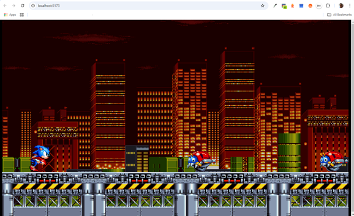
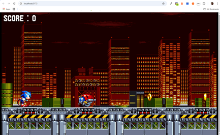

# SONIC-RUNNER-GAME

 Basado en este video: 

[](https://www.youtube.com/watch?v=EmMO0yQ7eeY)

>[!IMPORTANT] 
> * El código original está en este repositorio: 
>[sonic-runner
](https://github.com/JSLegendDev/sonic-runner)  
>del usuario [JSLegendDev](https://github.com/JSLegendDev) 
>desde Agosto 22 de 2024.
> * La librería base esta en este sitio: 
>[KAPLAY](https://kaplayjs.com/).
> * Esta es una guía para empezar:
[Instalación](https://kaplayjs.com/guides/install/).

## 00. Prerrequisito​s
1. Tener el Editor [Visual Studio Code](https://code.visualstudio.com/insiders/).
2. Extensiones insaladas dentro de 
`Visual Studio Code`:  
  * [Better Comments](https://marketplace.visualstudio.com/items?itemName=aaron-bond.better-comments) 
de [Aaron Bond](https://aaronbond.co.uk/).
  * [Error Lens](https://marketplace.visualstudio.com/items?itemName=usernamehw.errorlens) 
de [Alexander](https://marketplace.visualstudio.com/publishers/usernamehw).
  * [Javascript-Essentials](https://marketplace.visualstudio.com/items?itemName=Gydunhn.javascript-essentials)
  de [Gydunhn](https://marketplace.visualstudio.com/publishers/Gydunhn),  
  Este instala un paquete con:
    * ESLint
    * npm Intellisense 
    * IntelliCode
    * JavaScript (ES6) code snippets
    * Debugger for Firefox
    * Path Intellisense
    * Formatting Toggle
  * [Live Server](https://marketplace.visualstudio.com/items?itemName=ritwickdey.LiveServer)
  de [Ritwick Dey](https://marketplace.visualstudio.com/publishers/ritwickdey).
  * [Image preview](https://marketplace.visualstudio.com/items?itemName=kisstkondoros.vscode-gutter-preview)
  de [Kiss Tamás](https://marketplace.visualstudio.com/publishers/kisstkondoros)

## 01. Instalar el Ambiente
1. En una `TERMINAL` de `Visual Studio Code`, se ejecuta
este comando:
```bash
npm create vite@latest .
```
* `OK to Proceed? (y)` -> `y` o `[ENTER]`
* `Current directory is not empty` -> `Ignore files and continue`
* `Select a framework:` -> `Vanilla`
* `Select a variant:` -> `JavaScript`
2. Borramos estos archivos:
* **`counter.js`** 
* **`main.js`** 
* **`style.css`**
3. Creamos la carpeta "`src`" en la raíz del proyecto.
4. Creamos el archivo **`main.js`** dentro de "`src`".
5. Cambiamos en **`index.html`** la ruta del `<script` a
`src="src/main.js"`.
6. Para probar ejecutamos estos dos comandos en la `TERMINAL`:
```bash
  pnpm i
  pnpm dev
```
* Revisar la página que sugiere `http://localhost:5173/`

## 02. Código inicial

1. Descargamos los `assets` de este sitio: 
[`public`](https://github.com/JSLegendDev/sonic-runner/tree/master/public) y los copiamos en la misma
carpeta "`public`"
2. En una `TERMINAL` de `VSCode` ejecutamos el comando para instalar `kaplay`:
```bash
pnpm i kaplay
```
3. En el archivo **`main.js`**, poner la importación de `kaplay`
e inicializar el `canvas` de `kaplay`:
```js
import kaplay from 'kaplay';
kaplay();
```
4. Sino esta en ejecución , en una `TERMINAL`, este comando 
expone la página para ser vista en un browser:  
`pnpm dev`  
Veremos una cuadrícula similar a esta:  

5. Añadimos parámetros al inicializar el `kaplay` en **`main.js`**:
```js
kaplay({
  width: 1920,
  height: 1080,
  letterbox: true, // Para mantener el aspecto de relación
});
```

### Versión de Kaplay sugerida
>[!NOTE]  
>En el minuto 11:00 se sugiere q la instalación de `kaplay` en
>la `TERMINAL` sea con la una versión específica, con este 
>comando:
>```bash
>pnpm i kaplay@3001.0.0-alpha.21
>```
>Dice que otra versión falla para ser vista en Android, pero lo 
>tendremos en cuenta una vez llegado al tema.
> Por ahora la que tengo instalada es `3001.0.0-beta.8`.  
>Revisa la versión en el archivo **`package.json`**.

6. Seguimos añadiendo parámetros al llamado de `kaplay` en
 **`main.js`**:
 ```js
kaplay({
  width: 1920,
  height: 1080,
  letterbox: true, // Para mantener el aspecto de relación
  background: [0, 0, 0], // Es el color negro
});
 ```

 ### ESLInt o mejorador del código
 >[!IMPORTANT]
> 1. Instalar `nvm` descargando el instalador desde este sitio:
>[nvm-setup.exe](https://github.com/coreybutler/nvm-windows/releases/download/1.1.12/nvm-setup.exe).
> 2. Instalar el `node`, que a su vez
>trae el `npm` basado en este sitio: 
>[Instalar múltiples versiones de Node.js en Windows](https://rafaelneto.dev/blog/instalar-multiples-versiones-nodejs-windows/).  
>Con el `nvm` permite múltiples versiones
>del `node`.
> 3. El programa `pnpm` es similar al `npm`, siendo un mejor empaquetador.  
>Este lo puede conseguir con las instrucciones de este sitio
>[pnpm Installation](https://pnpm.io/installation).  
>4. Instalamos las extensiones en `Visual Studio Code`:
> * [ESLint](https://marketplace.visualstudio.com/items?itemName=dbaeumer.vscode-eslint) 
>de [Microsoft](https://www.microsoft.com/es-co/).
> * [Prettier - Code formatter](https://marketplace.visualstudio.com/items?itemName=esbenp.prettier-vscode)
>de [Prettier](https://prettier.io/)

>[!NOTE]
>1. En una `TERMINAL` del `Visual Studio Code`, ponemos este comando:
>```gitbash
>pnpm install standard -D
>```
>ó
>```gitbash
>npm i standard -D
>```
>* De preferencia el primero(`pnpm`) pero en caso que falle, 
>seguir usando el segundo(`npm`).
>2. Añadimos al **`package.json`**, el contenido de:  
>`"eslintConfig": { "extends" : "standard" },`, encima de
>`devDependencies`, quedando el **`package.json`** así:
>```json
>{
>  "name": "sonic-runner-game",
>  "private": true,
>  "version": "0.0.0",
>  "type": "module",
>  "scripts": {
>    "dev": "vite",
>    "build": "vite build",
>    "preview": "vite preview"
>  },
>  "eslintConfig": {
>    "extends": "standard"
>  },
>  "devDependencies": {
>    "standard": "^17.1.2",
>    "vite": "^5.4.9"
>  },
>  "dependencies": {
>    "kaplay": "3001.0.0-beta.8",
>    "sonic-runner-game": "file:"
>  }
>}
>```
>3. Creo el archivo **`.eslintrc.json`** 
>(OJO: El archivo empieza con el punto) y ponemos este texto:
>```json
> {
> "extends": ["standard"],
>   "rules": {
>     "semi" : [2, "always"],
>     "comma-dangle": [2, "always-multiline"] 
>   }
> }
>```
>4. La extensión de `Prettier` requiere ajustes, estos 
>se pueden hacer en el archivo de configuracion del usuario:  
>Presiono en `Visual Studio Code` las teclas: 
> [`Ctrl`] + [`Shift`] + [`P`]  
> y selecciono o busco `Open User Settings (JSON)`
>```json
>	"prettier.jsxSingleQuote": true,
>	"prettier.singleQuote": true,
>	"prettier.eslintIntegration": true,
>	"prettier.spaceParenthesis": true,
>	"[javascript]": {
>		"editor.defaultFormatter": "esbenp.prettier-vscode"
>	},
>	"[json]": {
>		"editor.defaultFormatter": "esbenp.prettier-vscode"
>	},
>```
>5. Presiono en `Visual Studio Code` las teclas: 
> [`Ctrl`] + [`Shift`] + [`P`]  
> y selecciono o busco `Restart ESLint Server`
>6. El Formato en `Visual Studio Code` se invoca con las teclas :  
>[`Alt`] + [`Shift`] + [`F`] 
> * Este proceso aplicó un nuevo formato a todos los archivos
> **`*.js`**

>[!WARNING]
>### El archivo **`package-lock.json`**, aparece, pero no es necesario, por ende lo borramos.

## 03. Usando **`kaplayCtx.js`**
1. Creamos el archivo **`kaplayCtx.js`** en la carpeta "`src`".
2. Cortamos lo hecho en **`main.js`** y lo pasamos a 
**`kaplayCtx.js`**.
3. Asignamos el valor de `kaplay()` a una una `const` de nombre
`k`:
```js
import kaplay from 'kaplay';

const k = kaplay({
  width: 1920,
  height: 1080,
  letterbox: true, // Para mantener el aspecto de relación
  background: [0, 0, 0], // Es el color negro
});
```
4. Añadimos mas parámetors a la función `kaplay()`:
```js
  global: false, //
```
5. Exportamos la `const k`
```js 
export default k;
```
6. En el archivo **`main.js`**, importamos este valor:
```js
import {k} from './kaplayCtx.js';
```
7. En **`kaplayCtx.jx`** para `kaplay()` añadimos otro parámetro
para tener en cuenta con los móbiles:
```js
  touchToMouse: true, // Acceso a los móbiles
```
8. Especificamos los botones en `kaplay()`:
```js
  buttons: {
    jump: {
      keyboard: ['space'],
      mouse: 'left',
    },
  },
``` 
9. Mas opciones en `kaplay()` de **`kaplayCtx.jx`** para
depuración:
```js
  debugKey: 'd', // la tecla `d` ae usará para hacer depuración
  debug: true, // Depuración siempre activa
```
10. Regreansando al browser donde se ejecuta esta página 
[localhost:5173](`http://localhost:5173/`), presionamos la tecla
[`d`] y nos parece un texto en pantalla: `FPS: 60`, o algo parecido.

## 04. Importamos los `assets` de "`public`"

1. En el archivo **`main.js`**, importamos los `assets`, empezando
por el fondo y la plataforma:
```js
k.loadSprite('chemical-bg', 'gaphics/chemical-bg.png');
k.loadSprite('platforms', 'gaphics/platforms.png');
```
2. Importamos el `sprite` de `'sonic'`, pero este es una imagen con
múltiples imágenes, entonces se agregan unos parámetros:
```js
k.loadSprite('sonic', 'gaphics/sonic.png', {
  sliceX: 8,
  sliceY: 2,
  anims: {
    run: { from: 0, to: 7, loop: true, speed: 30 },
    jump: { from: 5, to: 15, loop: true, speed: 100 },
  },
});
```
3. Lo mismo con `'motobug'`:
```js
k.loadSprite('motobug', 'gaphics/motobug.png', {
  sliceX: 5,
  sliceY: 1,
  anims: {
    run: { from: 0, to: 4, loop: true, speed: 8 },
  },
});
```
5. Agregamos el `'ring'` en **`main.js`**:
```js
k.loadSprite('ring', 'gaphics/ring.png', {
  sliceX: 16,
  sliceY: 1,
  anims: {
    spin: { from: 0, to: 15, loop: true, speed: 30 },
  },
});
```
6. Agregamos el tipo de letra o `font`:
```js
k.loadFont('mania', 'fonts/mania.ttf');
```
7. Agregamos los sonidos en **`main.js`**:
```js
k.loadSound('destroy', 'sounds/Destroy.wav');
k.loadSound('hurt', 'sounds/Hurt.wav');
k.loadSound('hyper-ring', 'sounds/HyperRing.wav');
k.loadSound('jump', 'sounds/Jump.wav');
k.loadSound('ring', 'sounds/Ring.wav');
k.loadSound('city', 'sounds/city.mp3');
```

## 05. Creando las escenas básicas

1. Creamos un folder dentro de "`src`" llamado "`scenes`".
2. Ponemos en **`main.js`**, el llamado a tres escenas y cual sería
la primer escena a mostrar:
```js
k.scene('main-menu', () => {});
k.scene('game', () => {});
k.scene('gameover', () => {});
k.go('main-menu');
```
3. En la carpeta "`src/scenes`" creamos el archivo **`mainMenu.js`**.
4. En **`mainMenu.js`**, importamos el contextos de `kaplay`:
```js
import k from '../kaplayCtx.js';
```
5. Creamos la función `mainMenu` y la exportamos por defecto:
```js
export default function mainMenu () {

}
```
6. En el archivo **`main.js`**, cambiamos el  
`k.scene('main-menu', () => {});` por  
`k.scene('main-menu', mainMenu);`  
y el debe de importar al principio
esto:  
`import mainMenu from './scenes/mainMenu.js';`.

## 06. Código Inicial en **`mainMenu.js`**

1. Voy a utilizar el `localStorage`, empiezo con una pregunta en
negativo para saber si la Data no existe, para crearla:
```js
  if (!k.getData('best-score')) k.setData('best-score', 0);
```
2. En el archivo el archivo **`mainMenu.js`**, pregunto por la tecla 
de `'jump'`, para llevarlo o cambiar al escenario `'game'`:
```js
  k.onButtonPress('jump', () => k.go('game'));
```
3. Creamos una constante de nombre `bgPieceWidth`, para saber cuando
debo cambiar la primera pieza del fondo, para q funcione el 
movimiento infinito de `scroll`, juntando dos imágenes, con valor
del ancho total del ancho definido en `kaplay`, es 1920.
 
>[!CAUTION]  
>### Corrijo de **`main.js`**, la ruta de las imágenes.
>### Corrijo también `'chemicak-bg'` por `'chemical-bg'`.

4. En el archivo **`mainMenu.js`** creamos la constante `bgPieces`, 
es un arreglo para almacenar dos valores de objetos del juego usando 
el método `k.add()`, añado componente como el `k.sprite` pasando una 
clave de las definidas en **`main.js`**. 
Otro componente sería `k.pos()`, especificando las coordenadas (x,y).
```js
  const bgPieces = [k.add([k.sprite('chemical-bg'), k.pos(0, 0)])];
```

>[!NOTE]  
>Hasta aquí, en el browser ya parece el fondo de pantalla del juego:  
>

5. Añado mas información a la constante `bgPieces`:
```js
  const bgPieces = [k.add([
    k.sprite('chemical-bg'),
    k.pos(0, 0),
    k.scale(2),
    k.opacity(0.8),
  ])];
```
6. Duplico la información dentro de la constante `bgPieces`, 
y corrijo la posición `x` del segundo por la constante 
`bgPieceWidth` multiplicada por `2`:
```js
  const bgPieces = [
    k.add([
      k.sprite('chemical-bg'),
      k.pos(0, 0),
      k.scale(2),
      k.opacity(0.8),
    ]),
    k.add([
      k.sprite('chemical-bg'),
      k.pos(bgPieceWidth *2, 0), // Se multiplica x 2 por la `scale`
      k.scale(2),
      k.opacity(0.8),
    ]),
  ];
```

## 07. Movimiento de `'chemical-bg'` y `'platforms'`

1. Creamos una variable con el ancho de la imagen de `platform` :  
`const platformWidth = 1280;`
2. Creamos la constante `platforms` en **`mainMenu.js`**, similar
al de `bgPieces`, pero con otro nombre clave:
```js
  const platforms = [
    k.add([
      k.sprite('platforms'),
      k.pos(0, 450),
      k.scale(4),
    ]),
    k.add([
      k.sprite('platforms'),
      k.pos(platformWidth * 4, 450), // Multiplicar x 4 (`scale`)
      k.scale(4),
    ]),
  ];
```

>[!NOTE]  
>Así se ve el juego en el browser:  
>

3. Usamos la función de `onUpdate`, para los movimientos en pantalla,
aprovechando que se refresca 60 veces por segundo:
```js
  k.onUpdate(() => {
    // Esto significa q está al finalizar de la imagen 2
    if (bgPieces[1].pos.x < 0) {
      // Cambiamos de posición
      bgPieces[0].moveTo(bgPieces[1].pos.x + bgPieceWidth * 2, 0);
      // Lo movemos simplemente
      bgPieces.push(bgPieces.shift());
    }
    // Movemos la velocidad a la izquierda, es decir en negativo
    bgPieces[0].move(-100, 0);
    // Cambiamos entre los valores de lo que hay en `bgPieces`
    bgPieces[1].moveTo(bgPieces[0].pos.x + bgPieceWidth * 2, 0);
  });
```

>[!NOTE]  
>Así se ve el juego en el browser, ya en movimiento:  
>

4. Agrego el parámetro `k.area()` a la lista de elementos de la
constante `bgPieces` en **`MainMenu.js`**:
```js
  const bgPieces = [
    k.add([
      k.sprite('chemical-bg'),
      k.pos(0, 0),
      k.scale(2),
      k.opacity(0.8),
      k.area(),
    ]),
    k.add([
      k.sprite('chemical-bg'),
      k.pos(bgPieceWidth * 2, 0), // Se multiplica x 2 por la `scale`
      k.scale(2),
      k.opacity(0.8),
      k.area(),
    ]),
  ];
```

>[!NOTE]  
> Si presiono la tecla [`d`] en medio del juego, aparece un dato
>en pantalla de la posición recorrida por la imagen del `sprite` de
>nombre `'chemical-bg'`:  
>

5. Removemos los componentes de nombre `k.area()`, pues no los 
necesitamos, pero se pueden activar para hacer un `debug`.
6. Añadimos algo similar para `platforms`, dentro del `k.onUpdate()`:
```js
    // Esto significa q está al finalizar de la imagen 2
    if (platforms[1].pos.x < 0) {
      // Cambiamos de posición
      platforms[0].moveTo(platforms[1].pos.x + platformWidth * 4, 450);
      // Lo movemos simplemente
      platforms.push(platforms.shift());
    }
    // Movemos la velocidad a la izquierda, es decir en negativo
    platforms[0].move(-4000, 0);
    // Cambiamos entre los valores de lo que hay en `platforms`
    platforms[1].moveTo(platforms[0].pos.x + platformWidth * 4, 450);
```

>[!NOTE]  
>Así se ve el juego en el browser, ya en movimiento de ambos:  
>

## 08. Creando el objeto `Sonic`
1. Creamos en la carpeta "`scr`" el folder de nombre "`entities`".
2. Creamos dentro de "`src/entities`" el archivo de nombre
**`sonic.js`**.
3. Creamos una función de nombre `makeSonic`, la cual la exportamos
y va a contener un parámetro:
```js
export function makeSonic (pos) {

}
```
4. Añadimos la importación del contexto de `Kaplay` en 
**`sonic.js`**:
```js
import k from '../kaplayCtx.js';
```
5. Creamos dentro de la función `makeSonic` la constante `sonic`:
```js
export function makeSonic (pos) {
  const sonic = k.add([
    k.sprite('sonic', { anim: 'run' }),
    k.scale(4),
    k.area(),
    k.anchor('center'),
    k.pos(pos),
  ]);
}
```
6. Llamamos la función `makeSonic()` en **`mainMenu.js`**, justo
antes del `k.onUpdate()`. El debe de importar esto :  
`import { makeSonic } from '../entities/sonic.js';`
```js
  makeSonic(k.vec2(200, 745));
```
>[!NOTE]  
>Automáticamente aparece la imagen de `sonic`, corriendo sobre las 
>`plataforms`.

## 09. Texto del Menú

1. Vamos a agregar un texto, justo antes de llamar el método
`makeSonic()` en **`mainMenu.js`**:
```js
  k.add([
    k.text('SONIC RING RUN', { font: 'mania', size: 96 }),
    k.pos(k.center()), // Aqui aparece del centro a la derecha
  ]);
```
>[!TIP]  
>Hasta aquí el texto aparece del centro a la derecha:  
>

2. Agregamos un `k.anchor()` al texto en el **`mainMenu.js`**,
y ahí si aparece en el centro, centro:
```js
  k.add([
    k.text('SONIC RING RUN', { font: 'mania', size: 96 }),
    k.pos(k.center()), // Aqui aparece del centro a la derecha
    k.anchor('center'), // Aqui lo organiza en el centro, centro
  ])
```
3. Ajuste final del texto para que aparezca a 200 del tope y en el
centro desde la izquierda:
```js
  k.add([
    k.text('SONIC RING RUN', { font: 'mania', size: 96 }),
    // k.pos(k.center()), // Aqui aparece del centro a la derecha
    k.pos(k.center().x, 200), // Aqui centro de `x` y a 200 en `y`
    k.anchor('center'), // Aqui lo organiza en el centro, centro
  ]);
```
4. Agregamos el texto que indique el accionar para pasar a la
escena siguiente:
```js
  k.add([
    k.text('Press Space/Click/Touch to Play',
      { font: 'mania', size: 32 }),
    k.pos(k.center().x, k.center().y - 200), // A
    k.anchor('center'), // Aqui lo organiza en el centro, centro
  ]);
```

>[!IMPORTANT]  
>Este es el resultado esperado del juego en el browser:  
>

## 10. Empezando la escena **`game.js`**
1. Creamos en "`src/scenes`" el archivo **`game.js`**.
2. También en el mismo folder el archivo **`gameover.js`**.
3. en ambos archivo añadimos la importación del contexto de `kaplay`:  
`import k from '../kaplayCtx.js';`
4. Empezando en **`game.js`**, creamos el método `game()` y lo
exportamos por defecto:
```js
export default function game () {}
```
5. En el archivo **`game.js`**, definimos la gravedad o caída de los
objetos:
```js
export default function game () {
  // Definimos la gravedad o caída d elos objetos
  k.setGravity(3100);
}
```
6. Copiamos de **`mainMenu.js`**, los datos de `bgPieces` y 
`platforms`, debajo de la definición de gravedad:
```js
  // Copiamos de **`MainMenu.js`**
  const bgPieceWidth = 1920;
  const bgPieces = [
    k.add([
      k.sprite('chemical-bg'),
      k.pos(0, 0),
      k.scale(2),
      k.opacity(0.8),
    ]),
    k.add([
      k.sprite('chemical-bg'),
      k.pos(bgPieceWidth * 2, 0), // Se multiplica x 2 por la `scale`
      k.scale(2),
      k.opacity(0.8),
    ]),
  ];

  const platformWidth = 1280;
  const platforms = [
    k.add([
      k.sprite('platforms'),
      k.pos(0, 450),
      k.scale(4),
    ]),
    k.add([
      k.sprite('platforms'),
      k.pos(platformWidth * 4, 450), // Multiplicar x 4 (`scale`)
      k.scale(4),
    ]),
  ];
```
7. Añadimos en **`game.js`**, una variable para el manejo de la
velocidad de nombre `gameSpeed` con valor inicial de:`300`.
8. Uso la función `k.loop()` que es un ciclo que se mueve en el 
tiempo, en este caso el valor es `1`, sería cada segundo:
```js
  k.loop(1, () => {
    gameSpeed += 50;
  });
```
9. Añadimos en **`game.js`**, la función `onUpdate()`, para refrescar
60 veces por segundo:
```js
k.onUpdate(() => {});
```
10. Copiamos la lógica del `bgPieces` de **`mainMenu.js`**:
```js
    if (bgPieces[1].pos.x < 0) {
      bgPieces[0].moveTo(bgPieces[1].pos.x + bgPieceWidth * 2, 0);
      bgPieces.push(bgPieces.shift());
    }
    bgPieces[0].move(-100, 0);
    bgPieces[1].moveTo(bgPieces[0].pos.x + bgPieceWidth * 2, 0);
```
11. Copiamos la lógica del `platforms` de **`mainMenu.js`**,
con algunos cambios como el uso de `gamespeed`:
```js
  if (platforms[1].pos.x < 0) {
    platforms[0].moveTo(platforms[1].pos.x + platformWidth * 4, 450);
    platforms.push(platforms.shift());
  }
  platforms[0].move(-gameSpeed, 0);
  platforms[1].moveTo(platforms[0].pos.x + platformWidth * 4, 450);
```
12. En el archivo **`main.js`**, en la función de la escena de 
nombre `'game'`, hacemos el llamado de el método `game()`,
tener presente q se importa `import game from './scenes/game.js';`:
```js
k.scene('game', game);
```

>[!NOTE]  
>Al dar click o enter en la imagen inicial, pasa a la escena `game`,
>similar a esta:  
>

## 11. Sonic sobre una `platform` invisible

1. Empezando en **`game.js`**, agregamos con un 
`k.add()`, un rectángulo invisible:
```js
  k.add([
    k.rect(1920,300),
    k.opacity(0), // Es invisible
    k.area(), // Se requiere para ver en el debug
    k.pos(0, 832),
    k.body({ // Para los factores de gravedad
      isStatic: true,
    }), 
  ])
```
>[!NOTE]  
>Al pasar a la escena del `game` y presionar la tecla
>[`d`], se ve el rectángulo invisible.

2. Añadimos el objeto `sonic` al juego:
```js
  const sonic = makeSonic(k.vec2(200, 745));
```
* Recuerde importar la entidad que contiene la
función `makeSonic()`:  
`import { makeSonic } from '../entities/sonic.js';`

## 12. Implementando `sonic` en el juego

1. En el archivo **`sonic.js`**, agregamos propiedades
personalizadas como `setControls`:
```js
    {
      setControls () {
        k.onButtonPress('jump', () => {
          if (this.isGrounded()) {
            this.play('jump');
            this.jump();
          }
        });
      },
    },
```
2. En el método `makeSonic()`, añadimos mas componentes
como es `body()` justo debajo de `k.pos()`:
```js
    k.body({ jumpForce: 1700 }),
```
3. En el `setControls ()` añado un `k.play('jump')`,
para que aparezca el sonido del salto:
```js
        k.play('jump', { volume: 0.5 });
```
4. Añado al nivel de `setControls ()` otro de nombre
`setEvents ()`:
```js
      setEvents () {
        this.onGround(() => {
          this.play('run'); // Esta es la animación
        });
      },
```
5. Regreso a **`game.js`**, justo debajo de la creación
del objeto `sonic`, va esto:
```js
  sonic.setControls(); // Llamo el control del salto
  sonic.setEvents(); // Para la carrera
```
6. En el archivo **`sonic.js`** debo retornar el valor
de la constante `sonic` en el método `makeSonic ()`.
7. Para que el fondo se mueva verticalmente cuando 
`sonic` hace el `jump`, implementar esto en 
**`game.js`**:
```js
    bgPieces[0].moveTo(bgPieces[0].pos.x, -sonic.pos.y / 10 - 50);
    bgPieces[1].moveTo(bgPieces[1].pos.x, -sonic.pos.y / 10 - 50);
```

## 13. Mostrando `motobug` en pantalla

1. Creamos el archivo **`motobug.js`** en la carpeta **"src/entities"**.
2. Copiamos lo mismo de la entidad **`sonic.js`** y le hacemos los
ajustes respectivos:
```js
import k from '../kaplayCtx.js';

export function makeMotobug (pos) {
  return k.add([
    k.sprite('motobug', { anim: 'run' }),
    k.scale(4),
    k.area({ shape: new k.Rect(k.vec2(-5, 0), 32, 32) }),
    k.anchor('center'),
    k.pos(pos),
    k.offscreen(),
    'enemy', // Esto es un `TAG`
  ]);
}
```
3. En el archivo **`game.js`** debajo de `gameSpeed += 50;`
creamos la constante `spawnMotoBug` como un método:
```js
  const spawnMotoBug = () => {

  };
```
4. Dentro de este método `spawnMotoBug()` llamamos la función
`makeMotoBug` asociándola a una constante:
```js
    const motobug = makeMotoBug(k.vec2(1920, 773));
```
5. Importamos la entidad en **`game.js`**:
```js
import { makeMotoBug } from '../entities/motobug.js';
```
6. Dentro del método `spawnMotoBug()` llamamos para `motobug`,
la función `onUpdate()`:
```js
    motobug.onUpdate(() => {
      if (gameSpeed < 3000) {
        motobug.move(-(gameSpeed + 300), 0);
        return;
      }
    });
```
7. En el mismo `onUpdate()` de `spawnMotoBug()` en el archivo
**`game.js`** ponemos el `move` de `motobug`:
```js
      motobug.move(-gameSpeed, 0);
```
8. Al `spawnMotoBug()` agregamos otro método de `motobug` y es `onExitScreen()`
```js
    motobug.onExitScreen(() => {
      
    });
```
9. En el método de `onExitScreen()`, Destruimos el `motobug` si la 
posición es menor a cero:
```js
      if (motobug.pos.x < 0) k.destroy(motobug);
```
10. En el `spawnMotoBug()` de **`game.js`** definimos un tiempo de 
espera de manera aleatoria
```js
    const waitTime = k.rand(0.5, 2.5);
    k.wait(waitTime, spawnMotoBug);
```
11. Por último y justo donde se cierra el método `spawnMotoBug()`,
llamamos este mismo método:
```js
  spawnMotoBug();
```

>[!NOTE]  
>Así es como se ve el juego en el browser.  
>Ya aparecen los `motobug`, aún sin hacer contacto
>o ejecutar una acción con el personaje u objeto `sonic`:  
>

## 14. Definiendo colisión `sonic` y `motobug` o `enemy`

1. en el archivo **`game.js`**, justo debajo de `sonic.setEvents();`
invocamos una función de nombre `sonic.onCollide();`, con parámetros:
```js
  sonic.onCollide('enemy', () => {

  });
```
2. Añadimos a la función de `sonic.onCollide()` la condición cuando
`sonic` no está en el piso:
```js
  sonic.onCollide('enemy', (enemy) => { // Colisión `sonic`,`enemy`
    if (!sonic.isGrounded()) { // `sonic` no esta en el piso
      k.play('destroy', { volume: 0.5 }); // Música o sonido
      k.play('hyper-ring', { volume: 0.5 }); // Música o sonido
      k.destroy(enemy); // Destruye el objeto
      sonic.play('jump'); // Suena música del salto
      sonic.jump(); // Toma un salto extra
      // TODO: Añadir los puntajes ganados
      return;
    }
  });
```
3. En caso de estar en el piso hace esto:
```js
    k.play('hurt', { volume: 0.5 }); // Sonido de dolor
    // TODO: Esto mismo con el puntaje
    k.go('gameover'); // Se va a la escena final
```

>[!NOTE]  
> Ya `sonic` salta y destruye los `enemy` o `motobug`, pero si es 
>alcanzado el juego termina y se va a una escena pendiente por hacer.

## 15. Empezando por la lógica del `ring`

1. Primero creamos la entidad de nombre **`ring.js`** en la carpeta
"`src/entities`"".
2. Copiamos el contenido de **`motobub.js`** y hacemos algunos ajustes:
```js
import k from '../kaplayCtx.js';

export function makeRing (pos) {
  return k.add([
    k.sprite('ring', { anim: 'spin' }),
    k.scale(4),
    k.area(),
    k.anchor('center'),
    k.pos(pos),
    k.offscreen(),
    'ring', // Esto es un `TAG`
  ]);
}
```
3. La lógica para el `score` es similar a la del método `spawnMotoBug()`
de **`game.js`**, con algunos cambios:
```js
  const spawnRing = () => {
    const ring = makeRing(k.vec2(1950, 745));
    ring.onUpdate(() => {
      // Movimiento constante
      ring.move(-gameSpeed, 0);
      ring.onExitScreen(() => {
        // Destruimos el `ring` si la posición es menor a cero:
        if (ring.pos.x < 0) k.destroy(ring);
      });
    });

    // Definimos un tiempo de espera de manera aleatoria
    const waitTime = k.rand(0.5, 3);
    k.wait(waitTime, spawnRing);
  };
  // Simplemente llamamos el método q muestra a `ring`
  spawnRing();
```
>[!NOTE]  
>Ya en el juego aparecen tanto los `motobug` como los `ring`:  
>  
>Los `ring` aún no colisionan con `sonic`.

4. En el archivo **`game.js`** debajo del método 
`sonic.onCollide('enemy')`, añadimos una nueva colisión para `sonic`:
```js
  sonic.onCollide('ring', (ring) => { // Colisión `sonic`, `ring`
    k.play('ring', { volume: 0.5 }); // Música o sonido
    k.destroy(ring); // destruye el objeto
    // TODO: Añadir los puntajes ganados
  });
```

## 16. Empezando los puntajes o el `score`

1. Creamos una variable antes de crear a `sonic` en el archivo
**`game.js`**, de nombre `score`, inicializada en `0`.
2. Otra variable de nombre `scoreMultiplier` en `0`.
3. Justo después de `k.destroy(ring);`, incrementamos la variable
`score`.
4. debajo de la creación de la variable `scoreMultiplier`, añadimos
la constante `scoreText`, como un objeto:
```js
  const scoreText = k.add([
    k.text('SCORE : 0', { font: 'mania', size: 72 }),
    k.pos(20, 20),
  ]);
```
>[!NOTE]  
>Así se ve ya el browser del juego con este `score`:  
>

5. Después de incrementar el `score` en `sonic.onCollide('ring')`
cambiamos el `scoreText`:
```js
    scoreText.text = `SCORE : ${score}`;
```
>[!NOTE]  
>Así se ve cuando acumula puntajes:  
>

6. Dentro de `sonic.onCollide('enemy')`, en el `//TODO` primero
lo reemplazamos por este código:
```js
      scoreMultiplier += 1;
      score += 10 * scoreMultiplier;
      scoreText.text = `SCORE : ${score}`;
```
7. En el método `k.onUpdate()`, de **`game.js`**,
añadimos una condicional si `sonic`
está en el suelo, entonces de reinicia el valor de `scoreMultiplier`:
```js
    if (sonic.isGrounded()) scoreMultiplier = 0;
```

## 17. Continuando el proceso de `score`

1. En el archivo **`sonic.js`**, agregamos una propiedad, justo antes
de `setControls ()`:
```js
      ringCollectUI: null, // Añadido, luego se define
```
2. Antes del `return` de **`sonic.js`**, asignamos el valor a la 
propiedad `ringCollectUI`:
```js
  sonic.ringCollectUI = sonic.add([
    k.text('', { font: 'mania', size: 24 }),
    k.color(255, 255, 0), // Yellow color
    k.anchor('center'),
    k.pos(30, -10),
  ]);
```
3. Cuando colecto un `ring` (`sonic.onCollide('ring')`), pongo en
`sonic.ringCollectUI` el texto de `'+1'` en **`game.js`** justo en el
`sonic.onCollide('ring')`:
```js
    sonic.ringCollectUI.text = '+1';
```
3. Espero 1 segundo y desactivo este mensaje , debajo de 
`...text = '+1';`:
```js
    k.wait(1, () => { sonic.ringCollectUI.text = ''; });
```
>[!NOTE]  
>Justo depués de colisionar con un `ring` aparece el pintaje de
>`'+1'`, frente a `sonic:`  
>

4. Aplicamos un proceso similar cuando `sonic` aplasta un `motobug`,
dentro del `sonic.onCollide('enemy')` de **`game.js`**:
```js
      if (scoreMultiplier === 1) sonic.ringCollectUI.text = '+10';
      else sonic.ringCollectUI.text = `x${scoreMultiplier}`;
      k.wait(1, () => { sonic.ringCollectUI.text = ''; });
```
5. Vamos a añadir el código en el comentario
`// TODO: Esto mismo con el puntaje` de **`game.js`**:
```js
    k.setData('current-score', score); // Paso el `score` a una variable
```
6. Creamos una constante al principio de la función `game()` del 
archivo **`game.js`**, para almacenar un sonido:
```js
  const citySfx = k.play('city', { volume: 0.2, loop: true });
```
7. Esta constante la pasamos como un parámetro mas cuando se llama
la escena `'gameover'` en **`game.js`**:
```js
    k.go('gameover', { citySfx }); // Se va a la escena final
```
  